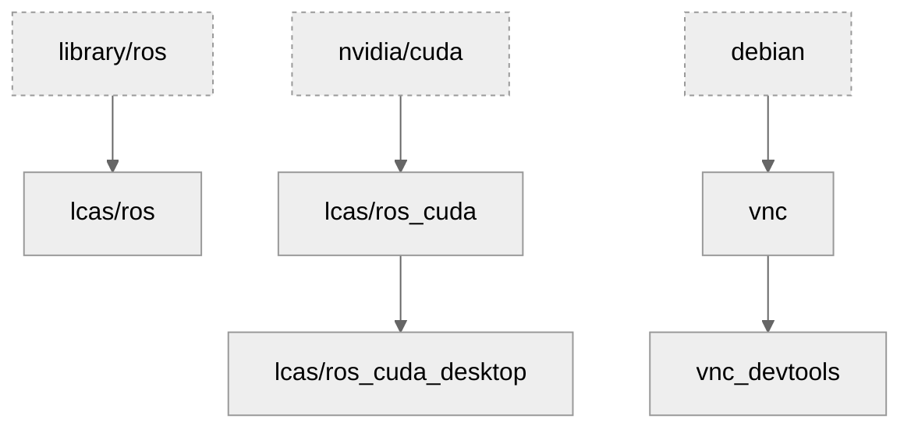

# AOC Container Base 

A repository of verstile Docker containers, orginally developed as apart of the [Agri-OpenCore (AOC) project](https://agri-opencore.org). Designed for the execution of simple and reliable containerised robotics solutions.

This repository manages the following containers:

| Container Name | Varients | Purpose | File |
| --- | --- | --- | --- |
| `lcas.lincoln.ac.uk/ros` | `humble` `jazzy` | Base ROS Container, the minimal environment you need for ROS | [base.dockerfile](base.dockerfile) |
| `lcas.lincoln.ac.uk/ros_cuda` | `humble` `jazzy` | ROS + Nvidia. When you need to use a GPU in your ROS environment for either better quality simulation or AI workloads. | [cuda.dockerfile](cuda.dockerfile) |
| `lcas.lincoln.ac.uk/ros_cuda_desktop` | `humble` `jazzy` | ROS + Nvidia + Packages. Installs the `ros-{distro}-desktop` varient so there is the full ROS stack available. | [cuda_desktop.dockerfile](cuda_desktop.dockerfile) |
| `lcas.lincoln.ac.uk/vnc` | `latest` | Standalone VNC container that can take X11 visualisations and show them in a browser. | [vnc.dockerfile](vnc.dockerfile) |

These containers are built from three standard container images, `ros`, `nvidia/cuda` and `debian`. Each container is either built from one of these pre-existing images or one derrived from it in this pattern.

## How can I use this?

### ROS

This works best if you follow the [`ros2_workspace_template`](https://github.com/lcas/ros2_pkg_template), use this as a template to build your own repositories, that contain the packages you want to ship.

You can work either inside the devcontainer or by running the container yourself, and then when you are ready start by enabling the deployment workflows and adding automated testing. Then once you're happy move this onto a real robot platform - and keep iterating till it works!

### VNC

One of the components `vnc` is a X11 destination allowing for graphical applications to be displayed in a web browser, either on the robot or remotely.

The general concept is that we take the `vnc` container image and deploy that only once[^vnc-plural], allowing to remove the bulk of having all the tools for a display inside every container.

[^vnc-plural]: We may want to deploy this multiple times, i.e. to support multiple displays for monitoring, but this is a-typical. But either way we are deploying as few displays as possible meaning we have less resource requirements.

#

Lincoln Centre for Autonomous Systems Research 