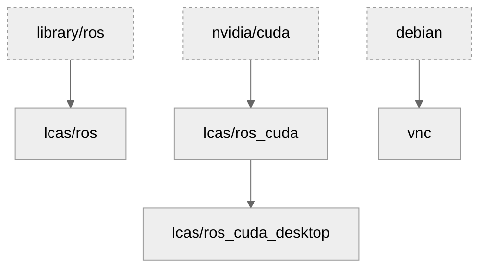
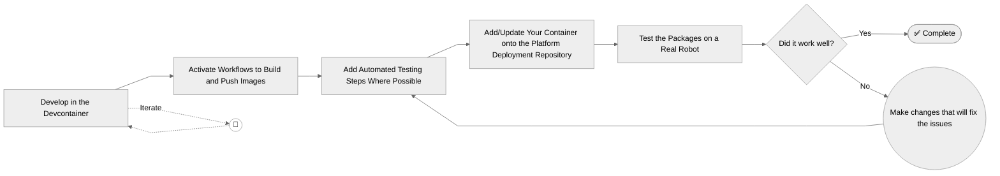

# AOC Container Base 

A repository of versatile containers, developed as part of the [Agri-OpenCore (AOC) project](https://agri-opencore.org). Designed for the execution of simple and reliable containerised robotics solutions.

This repository manages the following containers:

| Image | Tags | Includes | Choose This If... | Dockerfile |
| --- | --- | --- | --- | --- |
| `lcas.lincoln.ac.uk/ros` | `humble`, `jazzy` | Minimal ROS runtime and tooling, plus VirtualGL | You need ROS with graphical workflows (including VirtualGL-based rendering) but do not need NVIDIA CUDA | [base.dockerfile](base.dockerfile) |
| `lcas.lincoln.ac.uk/ros_cuda` | `humble-11.8`, `humble-12.8`, `jazzy-12.9` | ROS plus NVIDIA CUDA support | You need CUDA-enabled GPU acceleration for simulation or AI workloads | [cuda.dockerfile](cuda.dockerfile) |
| `lcas.lincoln.ac.uk/ros_cuda_desktop` | `humble-11.8`, `humble-12.8`, `jazzy-12.9` | ROS + CUDA + `ros-{distro}-desktop` package set | You need CUDA and the full ROS desktop stack | [desktop.dockerfile](desktop.dockerfile) |
| `lcas.lincoln.ac.uk/vnc` | `latest` | Browser-accessible VNC/X11 display endpoint | You need a shared web-based display target for GUI applications from other containers | [vnc.dockerfile](vnc.dockerfile) |

These containers are built from three standard container images, `ros`, `nvidia/cuda` and `debian`. Each container is either built from one of these pre-existing images or one derived from it in this pattern.

## How can I use this?

Choose your image using this quick guide:

- No CUDA, but graphical workflows: use `lcas.lincoln.ac.uk/ros` (as this includes VirtualGL).
- Need CUDA: use `lcas.lincoln.ac.uk/ros_cuda` or `lcas.lincoln.ac.uk/ros_cuda_desktop`.
- Minimal ROS only: if you do not need VirtualGL or the shared VNC environment, use [`ros` on DockerHub](https://hub.docker.com/_/ros).

### ROS

This works best if you follow the [`ros2_pkg_template`](https://github.com/lcas/ros2_pkg_template). Use it as a template to build your own repositories containing the packages you want to ship.

You can work either inside the devcontainer or by running the container yourself. When you are ready, enable the deployment workflows and add automated testing. Once you are happy, move this onto a real robot platform and keep iterating until it works.

### VNC

One of the components, `vnc`, is an X11 destination that allows graphical applications to be displayed in a web browser, either on the robot or remotely.

`vnc` is not ROS-specific; it can display applications from any container that outputs to X11. It also works with VirtualGL-based applications running in ROS containers, where VirtualGL forwards 3D rendering from those application containers to the host GPU, and the rendered frames are then shown through the VNC session.

The general concept is to deploy the `vnc` container image only once[^vnc-plural], which removes the need to include display tooling in every application container.

[^vnc-plural]: You may want to deploy this multiple times, i.e. to support multiple displays for monitoring, but this is atypical. Either way, we deploy as few displays as possible so we have lower resource requirements.
